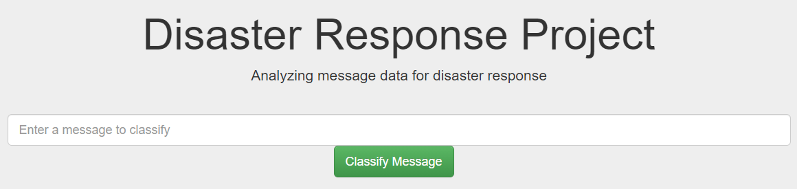
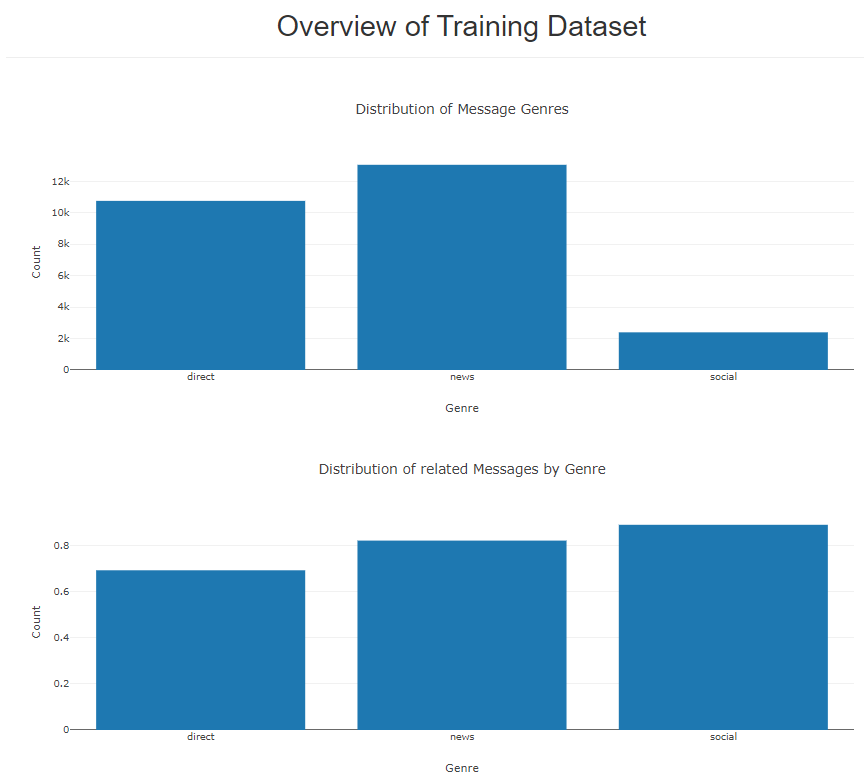
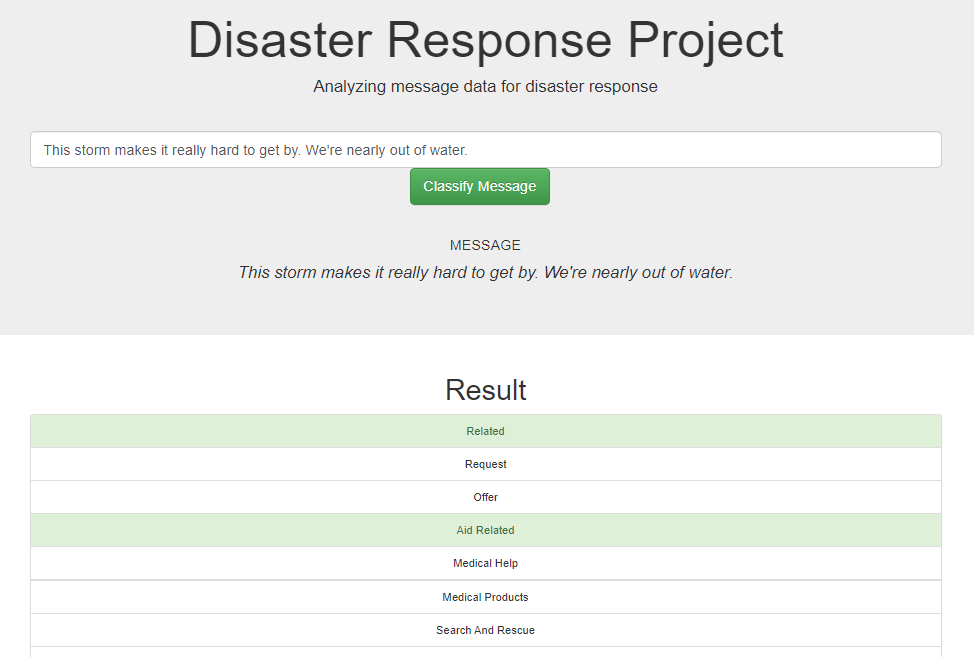

# Disaster Response Pipeline Project

---
## Table of Contents
- [Disaster Response Pipeline Project](#disaster-response-pipeline-project)
  - [Table of Contents](#table-of-contents)
  - [Project description](#project-description)
  - [Get it running](#get-it-running)
    - [Dependencies](#dependencies)
    - [Installation](#installation)
    - [Execution Instructions:](#execution-instructions)
  - [Screenshots](#screenshots)
  - [Additional Information](#additional-information)
    - [Author:](#author)
    - [License:](#license)
    - [Acknowledgements:](#acknowledgements)

---

## Project description
This project uses natural language processing to take disaster response related messages data, provided by [Figure Eight](figure-eight.com/), and classify them into different categories. The goal of this is to make disaster response easier and more efficient.

The results of this classification can be looked at via a web app, running on the local network.

In addition to this, two graphs are shown, describing some of the underlying data.

---

## Get it running
### Dependencies
This project was written in Python 3.9.1.
All other dependencies can be found in the requirements.txt.
### Installation
Clone this git repository to your machine.
### Execution Instructions:
1. Run the following commands in the project's root directory to set up your database and model.

    - To run ETL pipeline that cleans data and stores in database
        `python data/process_data.py data/disaster_messages.csv data/disaster_categories.csv data/DisasterResponse.db`
    - To run ML pipeline that trains classifier and saves
        `python models/train_classifier.py data/DisasterResponse.db models/classifier.pkl`

2. Run the following command in the project's root directory to run your web app.
    `python app/run.py`

3. Go to http://0.0.0.0:3001/ (or, if that does not work, to http://localhost:3001/)

---
## Screenshots

Provided training dataset overview:

Demo of the classification results:

---
## Additional Information
### Author: 
[Robert Offner](https://github.com/Gitznik)

### License: 

### Acknowledgements:
* [Udacity](https://www.udacity.com/) for providing the outline of the project and some of the code.
* [Figure Eight](https://www.figure-eight.com/) for providing the underlying data.